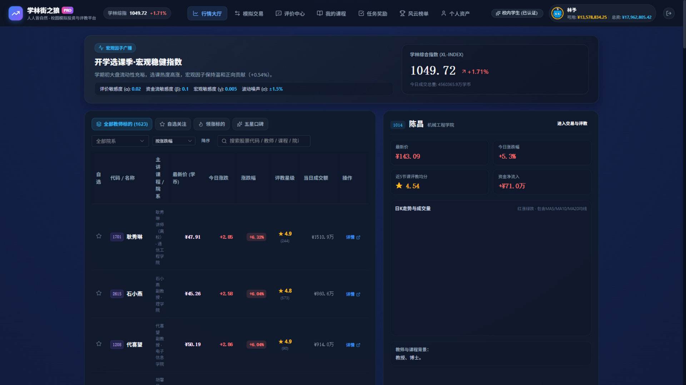
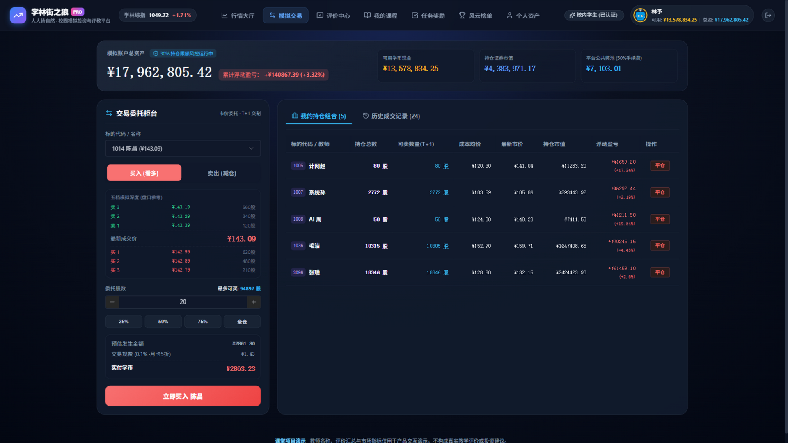
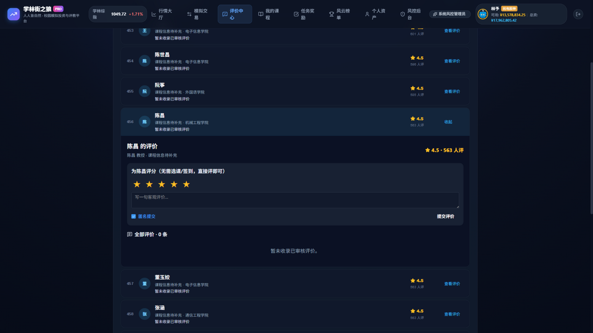

# 学林街之狼

> **在线体验**：<https://ephver.cn/xuelinjie/market>（示例账号 `林予` / `123456`，一键填入即可登录；右上角可切换学生 / 校外 / 教师 / 管理员四种身份。线上版本在仓库原型基础上迭代，已加入登录注册）

## 做什么

“学林街之狼”是校园教学评价与模拟投资激励平台的前端原型。它以行情看板形式整合课程、教师与评价信息：学生签到、匿名评教后获得虚拟积分，可模拟交易、领任务奖励并参与排行榜；管理端提供评教审核（通过/降权/屏蔽）、宏观参数调整与收盘结算。平台中的“股票”“交易”“资产”均为虚构标的和虚拟积分，仅用于教学互动演示，不涉及真实证券、支付、教师收入或投资建议。

## 给谁用

- 学生：浏览课程标的与 K 线、查看评教趋势，完成签到评教、模拟交易、任务与排行榜。
- 教师：只读查看课程与评价趋势。
- 教学管理者：评教审核、参数调整、收盘结算与趋势查看。

## 界面与玩法

| 行情大厅 | 模拟交易终端 | 评价中心 |
| --- | --- | --- |
|  |  |  |

## 技术选型

Vue 3 + TypeScript + Vite + Pinia + Vue Router + Element Plus + ECharts；业务规则抽离 `src/rules.ts` 供 store 与视图复用，以 `node --test` 固化 20 项边界测试。

## 团队与计划

钟森翔负责行情与标的详情，张善言负责评教规则与任务激励，王溢诚负责排行榜与管理端，组长张宏瑜负责统筹、文档、导航路由与集成验收；2026-09-05 起周金淼调整为评教中心浏览体验、我的课程入口与公共交互。详细立项报告、日报、提示词与需求清单见 `docs/24320230/`、`daily/24320230/`、`prompts/24320230/` 与 `todos.md`。

组内记录纪律（2026-09-06 定版执行）：`daily/` 与 `prompts/` 只记录当日事实，未来日期文件不照单合流、须由作者当日重写，详见开发说明 §开发约定第 6 条。
