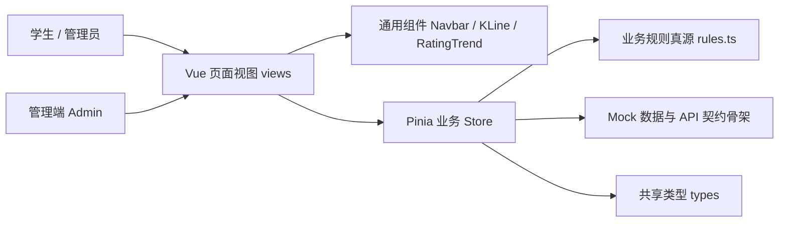

# “学林街之狼”项目设计报告

**课程：《项目实践1》（S0502891）**

**报告人：张宏瑜（组长）**

**学号：24320230**

**项目团队：钟森翔、周金淼、张善言、王溢诚、张宏瑜**

**日期：2026-09-06**

## 摘要

本项目是一个校园教学评价与模拟投资激励平台的前端原型。项目以行情看板的交互形式整合课程、教师与评价信息，通过模拟交易、任务奖励和排行榜提升学生的课程参与度，并为教学管理提供评价审核与趋势查看入口。系统基于 Vue 3 + TypeScript + Vite 构建，采用 Pinia 管理跨页面业务状态、Vue Router 组织页面路由、ECharts 实现 K 线与趋势可视化。项目将交易、奖励与评价审核等核心业务规则收敛为单一纯函数真源 `src/rules.ts`，并以 20 项单元测试与多次构建、浏览器人工验收作为质量依据。项目中的“股票”“交易”“资产”均为虚构标的与虚拟积分，仅用于教学互动演示。

## 一、项目背景与需求分析

### 1.1 背景与问题

学生在选课与学习过程中需要了解课程特征、教学反馈与个人进度，教师与教学管理者需要获得直观、可追溯的课程评价反馈。传统评价方式存在信息分散、反馈滞后、参与动力不足等问题：学生难以对课程形成整体认知，管理者缺少审核与趋势观察的统一入口。

### 1.2 用户与核心场景

项目服务两类角色：

- **学生**：浏览课程标的与详情，比较课程热度、评分与趋势，完成签到、匿名评教、模拟交易与任务奖励领取，形成个人资产与排行可见的成长反馈。
- **教学管理者**：审核评价内容，调整宏观因子等模拟参数，执行收盘结算演示，观察评价聚合结果。

### 1.3 项目目标与边界

1. 交付可运行、可构建的单页 Web 原型，覆盖行情、详情、交易、课程、评教、任务、排行榜、个人中心与管理端核心场景。
2. 以统一类型与状态管理支撑跨模块数据联动，评价可实时回写标的评分与趋势。
3. 把易变的业务规则从页面与 store 中抽出、集中、可测化，消除“同一规则多处实现不一致”的隐患。
4. 明确非金融边界：全部数据为虚构标的与虚拟积分，不涉及真实证券、支付与投资建议；本期不实现真实账号、后端与持久化。

## 二、总体设计

### 2.1 技术选型

| 技术 | 用途 | 选型理由 |
| --- | --- | --- |
| Vue 3 + Composition API | 页面与组件 | 组合式 API 适合按业务切片组织逻辑，SFC 便于多人分文件协作 |
| TypeScript | 类型约束 | 联合类型与接口约束跨 store/视图的数据口径，降低合流错误 |
| Vite | 开发与构建 | 启动快、构建快；chunk 拆分与体积告警便于做包体治理 |
| Pinia | 全局状态 | store 化交易、行情、评价、任务与用户资产，跨页数据联动 |
| Vue Router | 路由 | 统一页面入口、懒加载与元信息标题管理 |
| Element Plus | UI 组件 | 表单、表格、反馈组件齐全，可整库按需注册 |
| ECharts | 可视化 | K 线、趋势图支持良好，支持按需注册减小体积 |

架构上坚持分层职责：`views` 只负责展示与交互，业务读写集中在 `stores`，规则计算收敛在 `rules.ts` 纯函数，Mock 与未来 API 层位于 `store` 之下作为数据源替换点。

### 2.2 总体架构



### 2.3 工程结构

```text
src/
  components/       导航、K 线、评教趋势、彩蛋等可复用组件
  mock/             初始模拟数据与教师档案数据
  router/           路由表与页面标题
  stores/           market / trade / evaluation / task / user / ranking
  api/              evaluationTaskApi.ts（契约先行骨架）
  utils/            格式化、课表解析、行情路由状态、彩蛋
  rules.ts          业务规则唯一真源（纯函数）
  types/            跨模块共享类型
  views/            Market / StockDetail / Trade / MyCourses / Evaluation
                    / Task / Ranking / Profile / Admin 页面
  App.vue           应用外壳与路由出口
  main.ts           应用入口与插件按需注册
```

### 2.4 状态边界设计

| Store | 职责 | 关键状态 |
| --- | --- | --- |
| market | 行情、标的、宏观因子、K 线缓存、选中 | stocks、macroFactor、klineCache、selectedCode |
| trade | 订单、持仓批次、可卖计算 | orders、positions、settled、account 汇总 |
| evaluation | 课程、签到、评价与审核状态 | sessions、evaluations、importedCourses |
| task | 任务进度、领取、跨天结算 | tasks、lastDailyDate |
| user | 身份、角色、余额、账本 | role、balance、ledger、monthCard |
| ranking | 排行派生 | 排行列表（只读展示口径） |


## 三、需求清单

按 `todos.md` 需求清单跟踪，当前完成情况：已勾选 R1–R10、R14、R16（12/17），待办 R11–R13、R15、R17。

| 编号 | 需求 | 状态 | 主要落点 |
| --- | --- | --- | --- |
| R1 | Vue 3 + TS + Vite 工程 | 已完成 | 工程脚手架、构建脚本 |
| R2 | 导航与页面路由 | 已完成 | Navbar、router/index.ts、路由元信息 |
| R3 | 行情与基础指标 | 已完成 | MarketView、stores/market.ts |
| R4 | 详情、K 线、评教趋势 | 已完成 | StockDetailView、KLineChart、RatingTrendChart |
| R5 | 模拟买卖、手续费、T+1 | 已完成 | stores/trade.ts、rules.ts、TradeView |
| R6 | 签到、匿名评教与状态展示 | 已完成 | EvaluationView、stores/evaluation.ts |
| R7 | 任务奖励与排行榜 | 已完成 | TaskView、RankingView、对应 store |
| R8 | 个人资产与管理端 | 已完成 | ProfileView、AdminView |
| R9 | Mock、共享类型、Pinia | 已完成 | mock/、types/、六个 store |
| R10 | 生产构建验证 | 已完成 | 历次 npm run build（V1/V3/V5/V7/V9） |
| R14 | 交易/奖励/评价审核单元测试 | 已完成 | rules.ts 纯函数、tests/rules.test.ts 20 项 |
| R16 | 图表包体与按需加载优化 | 已完成 | ECharts 按需、Element Plus 按需、vendor 拆分 |
| R11 | 后端 API 契约与请求层 | 待办 | api/evaluationTaskApi.ts 契约草案已先行 |
| R12 | 登录、角色权限与路由守卫 | 待办 | 当前角色切换为模拟入口 |
| R13 | 持久化数据替换 Mock | 待办 | 刷新后恢复 Mock 初始状态 |
| R15 | 加载/空数据/失败重试 | 待办 | 已有部分空态与提示 |
| R17 | 报告、演示素材与交付 | 待办 | 本报告与系统文档、演示脚本推进中 |

## 四、核心模块详细设计

### 4.1 行情大厅（/market）

数据来自 `marketStore`。页面维护本地视图态：检索词 `searchQuery`、过滤维度 `activeTab`（全部/自选/领涨/高分）与排序字段 `sortBy`。过滤与排序结果由 computed 派生，不写回 store。交互包括：Tab 与关键词叠加过滤、行点击更新选中标的、自选切换（`toggleWatchlist`）、进入 `/stock/:code` 详情。右上行情指数与宏观因子来自统一 store，供管理端调整后全站联动。

### 4.2 标的详情与次日预测（/stock/:code）

详情页以路由参数 `code` 为主定位标的，`marketStore.selectedCode` 兜底，避免跨页跳转时数据闪烁。页面同时消费行情、交易、评价与用户四个 store：

- 展示教师信息、评分、热度、成交量与聚合指标；
- 用 `klineCache` 绘制 K 线，用近 5 条评分窗口绘制评教趋势；
- 提供买卖方向切换、快捷仓位与股数输入，提交前按 `rules.ts` 做同一套规则校验；
- 次日预测按“宏观因子 + 当前评分”在 `calculateNextDayProjection` 中分解为 E（评分）、F（因子）、M（宏观）、N（综合）四个分量与预估价，向用户解释涨跌成因。

### 4.3 模拟交易与资产账本（/trade、/profile）

交易设计为“规则前置、账本单一、展示派生”：

1. **规则前置**：买入/卖出前后统一调用 `rules.ts` 中的校验与计算函数（费率、金额、应付、风控、可卖批次），杜绝视图内各自实现造成口径漂移；
2. **账本单一**：成交写入 `orders` 与持仓批次 `positions`，资金与手续费沉淀在 `ledger` 与 `feePool`，个人中心的余额、市值、收益全部由此派生；
3. **T+1 约束**：每个持仓批次记录 `settled` 可售状态，卖出时按 FIFO 从可售批次中扣减（`deductSellableLots`），不允许卖出当日买入股数。

手续费规则为规费 0.1%（月卡 5 折后 0.05%），其中 50% 留存奖池；单标的持仓不得超过总资产 30%（`POSITION_LIMIT_RATIO`），超出由前端拦截并提示。

### 4.4 签到、评教与任务激励（/courses、/evaluation、/tasks）

评教链路为：**我的课程 → 签到 → 评教 → 聚合回写 → 任务进度 → 领取奖励**。

- 签到幂等，重复签到不重复发奖，签到奖励 100；评教奖励 80；
- 评教前置校验为“已签到、未重复评、评语非空”，评价默认匿名（`anonymous !== false` 脱敏为“校内匿名同学”）；
- 评价提交后按 `applyRatingAggregation` 更新评分快照：维持 5 条窗口的 last5Avg，并对评级做 EMA 平滑，再经 `calcRatingFactorEarning` 生成评分因子回写行情，形成“学生评教 → 行情变化 → 学生可感知”的闭环；
- 任务分日常/学期/成长（成就），进度只增不减并封顶 target，领取条件为“进度达标且未领取”；每日任务采用惰性跨天判定（`shouldResetDaily`），首次打开当天页面时保留演示数据，仅在确实跨天时归零。

### 4.5 排行榜与管理端（/rankings、/admin）

## 五、业务规则真源与关键算法

### 5.1 为什么需要一个“规则真源”

开发中曾出现同一手续费规则在 store 买卖与交易页、详情页预估处多份内联拷贝，其中预估处未应用月卡 5 折，导致“预估应付”与“成交结算”不一致。本项目因此将三类易变业务规则整体收敛到 `src/rules.ts`，只以纯函数暴露，商店与视图统一消费，消除拷贝漂移，并为规则编写单元测试。

### 5.2 规则清单

| 类别 | 关键导出 | 语义 |
| --- | --- | --- |
| 评价聚合 | `RATING_WINDOW=5`、`applyRatingAggregation`、`clampRating` | 评分约束 1~5；近 5 条窗口前插截断；首条记录直接作为 last5Avg；EMA 平滑到 1 位 |
| 因子公式 | `RATING_FACTOR_ALPHA=0.02`、`calcRatingFactorEarning` | 评分因子 E = α × (近 5 均分 − 3.0) / 2，把评价折为行情因子 |
| 交易费率 | `TRADE_FEE_RATE=0.001`、`tradeFeeRate`、`calcTradeFee` | 规费 0.1%；月卡 5 折；`FEE_POOL_RETAIN_RATIO=0.5` 留存奖池 |
| 仓位风控 | `POSITION_LIMIT_RATIO=0.3`、`exceedsPositionLimit`、`calcMaxAdditionalSharesToLimit` | 单标的市值 ≤ 总资产 30%；恰好 30% 不触发；预算不足归零，整股截断 |
| T+1 账本 | `calcWeightedCostPrice`、`deductSellableLots` | 加仓按持仓金额加权摊薄均价；卖出从可售批次 FIFO 扣减，不修改入参 |
| 奖励与任务 | `SIGNIN_REWARD=100`、`EVALUATION_REWARD=80`、`canClaimTaskReward`、`nextTaskProgress` | 进度只增不减并封顶 target；达标且未领取方可领奖 |
| 每日结算 | `shouldResetDaily`、`resetDailyTask`、`autoCompleteLoginTask` | 仅当存在上次日期且确实跨天才重置；登录任务当日自动达成 |
| 评价审核 | `AUDIT_STATUSES`、`isReviewPublic` | 审核状态仅 通过/驳回/降权；对外公开口径仅 APPROVED |

### 5.3 关键算法说明

**（1）滑动窗口评分聚合与 EMA 平滑。** 聚合同时维护两个口径：`last5AvgRating` 取最近 5 条评价的算术平均，用于“趋势图最近值”；评级因子走指数移动平均（新分权重 0.05），避免单条高分或低分评价造成行情骤变。窗口与公式都被测试锁定，保证“评一条 → 更新一条 → 展示同步”。

**（2）T+1 分批账本与 FIFO 可卖扣减。** 持仓按成交批次存储，每批含数量、成本价与 `settled` 标记。卖出时先汇总“已可卖批次的可用股数”，再按时间先后（FIFO）逐个批次扣减；扣减实现为纯函数返回新列表，不改原数组。当日买入批次因未到 T+1 不可卖，测试用例验证“未解锁批次被完整保留”。

**（3）加仓摊薄成本。** 同标的多次买入采用按持仓金额加权的摊薄成本：`(旧市值 + 新成交额) / (旧股数 + 新股数)`，结果保留两位，供个人资产页展示成本与浮动收益。

**（4）每日任务惰性结算。** 不引入定时器，改在读取/触发时用日期字符串比对，跨天才执行重置；同日首次打开保留演示数据，保证演示场景可重现，又保证真实使用中每日任务会按天刷新。

## 六、创新点

1. **规则单真源 + 纯函数可测化（架构级创新）**。把最容易漂移的交易、奖励与审核规则集中到 `rules.ts`，store、视图与（未来）服务端共用同一基准，并以 `node --test` 落地 20 项边界测试。这一设计使“前端原型”的规则具备类契约的稳定性，是后续接后端时评审口径的统一依据。
2. **“评价 → 行情”闭环的数据联动模型**。将课程评价抽象为可影响虚拟标的的行情事件：签到与评教触发奖励与任务推进，评教经滑动窗口聚合与 EMA 平滑后生成评分因子回写标的，管理端可审核、可下调、可观察趋势——评价不再是孤立的文字，而是驱动一个可感知、可治理的虚拟市场。
3. **评分审查与公开口径的状态机设计**。审核采用“通过/驳回/降权”三态而非简单删除：驳回即拒收，降权保留记录但不进入公开口径（`isReviewPublic` 仅 APPROVED 放行），既保护评价者表达空间，也保护被评价对象，避免删库式处理丢失治理痕迹。
## 七、测试与运行结果

### 7.1 构建与单测

项目定义 `npm run build`（Vite 生产构建）与 `npm run test`（`node --test tests/rules.test.ts`）两个质量门。最新基线（aa0e35e）实测：

- 构建：`✓ 3963 modules transformed`、`✓ built in 7.23s`、退出码 0、无超限告警；
- 测试：`tests 20 / pass 20 / fail 0`。

完整证据按“命令 + 时间 + 关键输出 + 被测基线”登记在 `docs/24320230/验证记录.md`（V1–V10），关键里程碑：

| 编号 | 基线 | 验证内容 | 关键结果 |
| --- | --- | --- | --- |
| V1/V2 | 5d7bef9 | 基线构建与测试 | 3969 modules；10/10 |
| V3/V4 | 88a51e4 | R16 echarts 按需化 | 图表 1122.72→548.95 kB；10/10 |
| V5/V6 | 9db0908 | R16 收尾：element 按需 + vendor 拆分 | index 874.23→21.20 kB，500 kB 告警归零；10/10 |
| V7/V8 | e969258 | R14 规则可测化收口 | 测试 10→20 全绿；build 3958 modules |
| V9/V10 | aa0e35e | D6 合流龙虎榜后复测 | 3963 modules；20/20 |

### 7.2 浏览器人工验收

按“行情大厅 → 个股详情 → 模拟买入 → 持仓/资产 → 我的课程签到 → 评教 → 任务领取 → 排行榜 → 管理端审核与结算”逐页人工走通，无空白页与控制台阻断错误（问题台账 D3-005 关闭记录）。`todos.md` 已完成项均以实测复核为准；R14/R16 达成均伴随当日提交与 V7–V10 实测登记，不静默勾选。

### 7.3 运行结果一致性核查

针对“月卡预估未打折”的口径问题，R14 收口后对同一笔下单在“详情页预估、TradeView 下单、store 结算”三个展示点做交叉核对，三处一致消费 `rules.ts`，不再出现口径漂移；针对“评价审核是否即时下架”与“当日买入是否可卖”等边界，均在浏览器中构造对应数据验证通过（详见问题台账与验证记录）。

## 八、运行结果分析与问题解决

### 8.1 问题一：全量合流后项目无法构建（合并污染）

- **现象**：`src/router/index.ts` 出现两套路由定义与两个 `export default router`；`initialData.ts` 重复导出同名符号；多个页面存在重复 `<script setup>` 区块，项目直接构建失败。
- **原因分析**：冲刺期并行分支多、共享文件（路由、Mock、类型、全局样式）被多人同时修改，组员提交未逐个复测便合流，且合并工具无法自动处理“同文件结构性重复”。
- **解决过程**：以保留功能为第一原则逐文件清理——路由只留一套并保留新增 `/courses`；初始数据保留含完整教师数据的版本并去重；每个 SFC 只保留一套脚本块；为缺失的 `scheduleImport` 补建课表解析工具并安装 `xlsx`。修复后构建通过并立即登记问题台账。
- **改进思路**：共享文件变更前必须组内同步、合流前执行构建、问题一律进台账闭环——此后 D4–D6 未再出现同类污染。

### 8.2 问题二：月卡折扣口径漂移

- **现象**：交易页与详情页下单预估未应用月卡 5 折，与 store 结算结果不一致。
- **原因分析**：手续费同一规则存在多处内联拷贝，其中预估实现遗漏了月卡分支，属于典型的“拷贝式重复 + 无测试兜底”。
- **解决过程**：将交易、奖励、审核三组规则收敛为 `rules.ts` 纯函数，三处调用方统一改为消费规则；新增费率与月卡折扣用例，测试由 10 项扩至 20 项。
- **改进思路**：易变业务规则不再允许视图内联实现；新增规则必须先写测试再改消费方（测试先行），并在代码评审中检查是否仍在页面中出现魔法数字。

### 8.3 问题三：图表与入口包体超限

- **现象**：Vite 构建提示图表相关 chunk 超 500 kB 阈值。
- **原因分析**：K 线组件以 `import * as echarts` 全量引入；Element Plus 与 300+ 图标全量注册；构建未做 vendor 拆分。
- **解决过程**：ECharts 改为按需注册（需用到的图表/组件逐项 `echarts.use`）；Element Plus 全量改 15 组件按需；移除全量图标注册；Vite 按 echarts/xlsx/element/vue 拆分 vendor chunk；对残余数据 chunk 在配置中注释披露 750 kB 阈值的依据。
- **改进思路**：任何新增图表/图标都按“用到再注册”原则；体积前后对比随提交留证，防止回归。

### 8.4 其它问题与结论

自动点击课程页签到按钮出现元素稳定性超时，经人工鼠标操作验证功能正常，判定为自动化定位问题而非业务缺陷（D3-007 关闭）。浏览器验收、7 项→20 项测试与多次全量构建共同构成质量结论：当前原型核心主流程无阻断性缺陷，可交付演示。

## 九、总结与展望

本项目在五天冲刺内完成了一个可构建、可演示、规则可测的校园评价与激励平台原型：R1–R10、R14、R16 达成，20 项规则测试全绿，构建无告警，浏览器主流程验收通过。过程中最大的收获是两条工程经验：**把易变规则收敛成单一真源并用测试锁死**，以及**把共享文件的协作秩序当成工程质量的一部分**。

项目仍是“契约先行”的前端原型：R11 接口契约草案已建立（`api/evaluationTaskApi.ts`），R13 尚未接入持久化，R12 权限为模拟入口，R15 的加载与错误状态仍待完善。后续将按 R11–R13 接入 API 与身份权限，把 `rules.ts` 作为前后端共同基准镜像到服务端，并在 K 线数据为空、网络失败等场景补全体验。就课程目标而言，团队在分析与解决问题、团队协作、项目管理与沟通表达上的能力，已在一次次合流、验收与答辩组织中得到真实检验。

## 参考文献

[1] Vue.js. Vue 3 Composition API 文档[EB/OL]. https://cn.vuejs.org/.

[2] Vite. Vite 构建与拆包配置文档[EB/OL]. https://vitejs.dev/.

[3] Pinia. Pinia 状态管理文档[EB/OL]. https://pinia.vuejs.org/.

[4] Vue Router. Vue Router 路由指南[EB/OL]. https://router.vuejs.org/.

[5] Apache ECharts. ECharts 按需引入文档[EB/OL]. https://echarts.apache.org/.

[6] Node.js. node:test 单元测试文档[EB/OL]. https://nodejs.org/docs/latest/api/test.html.

[7] TypeScript. TypeScript Handbook[EB/OL]. https://www.typescriptlang.org/docs/.


