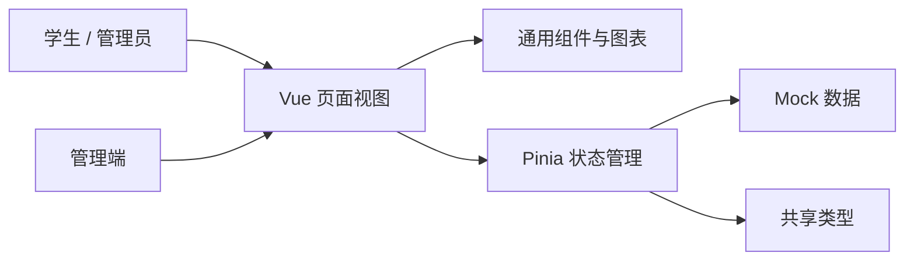

# “学林街之狼”项目立项书

## 一、项目基本信息

| 项目名称 | 学林街之狼 |
| --- | --- |
| 项目类型 | 校园教学评价与模拟投资激励平台前端原型 |
| 建设形式 | 五人小组协作开发 |
| 技术路线 | Vue 3、TypeScript、Vite、Pinia、Vue Router、Element Plus、ECharts |
| 项目周期 | 建议 6 周 |

## 二、立项背景与意义

学生在选课和学习过程中，需要了解课程特征、教学反馈与个人学习进度；教师和教学管理者也需要获得更直观、可追溯的课程评价反馈。传统评价系统常见信息分散、反馈滞后、参与动力不足等问题。

本项目以“行情看板”的交互形式组织课程评价信息，并通过虚拟积分、任务和排行榜提升参与感。平台将课程、教师与评价数据以可视化方式呈现，帮助学生形成更清晰的课程认知，为教学管理提供可查看、可审核的反馈入口。

项目中的“股票”“交易”“资产”等概念仅用于教学互动和产品原型表达，全部使用虚构标的、虚拟积分和模拟数据，不涉及真实证券交易、教师薪酬、真实金融产品或任何投资建议。

## 三、项目目标

1. 建设一个可运行的单页 Web 前端原型，覆盖行情浏览、模拟交易、课程评价、任务激励、排行榜、个人中心和管理端等核心场景。
2. 通过统一的数据模型和 Pinia 状态管理，实现各功能模块之间的数据联动。
3. 通过 K 线、趋势图和排行榜等可视化组件，提高课程评价信息的可读性。
4. 建立匿名评价、审核处理和规则提示等机制，为后续接入真实业务数据预留边界。
5. 形成可维护的前端工程结构、协作规范和演示材料，支持后续迭代与课程验收。

## 四、建设内容与功能范围

### 4.1 行情与课程信息

- 展示虚拟课程标的的价格、涨跌、热度、评分、成交量等聚合指标。
- 支持进入标的详情，查看课程、教师、院系、近期评价和 K 线数据。
- 通过评教趋势图展示近期评分变化。

### 4.2 模拟交易与资产

- 支持买入、卖出、持仓、交易记录和资产流水。
- 在前端实现手续费、仓位上限、T+1 可售数量等模拟规则。
- 在个人中心展示余额、持仓市值、收益和权益信息。

### 4.3 评价、任务与激励

- 支持到课签到、匿名评价、评分、标签和文字反馈。
- 提供待审核、通过、驳回和降权等评价状态。
- 设置日常、学期和成就任务，完成后发放虚拟奖励。
- 通过排行榜和周称号展示用户参与成果。

### 4.4 管理端

- 展示和调整宏观因子等模拟参数。
- 审核课程评价并更新评价状态。
- 支持模拟收盘结算，作为数据变化演示入口。

### 4.5 本期不包含的内容

- 真实证券交易、支付、充值、提现或投资建议。
- 未经授权收集或公开学生、教师的个人信息。
- 生产级账号认证、后端服务、数据库和真实数据对接。

## 五、总体方案

项目采用 Vue 3 单页应用架构。`views/` 承载页面级场景，`components/` 复用导航和图表组件，`stores/` 管理业务状态，`mock/` 提供原型数据，`types/` 维护共享 TypeScript 类型，路由集中于 `router/`。

当前版本采用前端 Mock 数据以快速验证交互流程。后续接入后端时，将在 store 与数据源之间增加 API 层，使页面组件保持以展示和交互为主的职责。

## 六、技术可行性

| 技术 | 用途 | 选择理由 |
| --- | --- | --- |
| Vue 3 + TypeScript | 前端页面开发 | 组件化清晰，类型约束降低协作错误 |
| Vite | 本地开发与构建 | 启动和构建速度快，配置轻量 |
| Pinia | 全局状态管理 | 适合管理交易、评价、任务和用户等跨页面状态 |
| Vue Router | 路由管理 | 支持多场景页面组织与懒加载 |
| ECharts | 数据可视化 | 可实现 K 线、趋势等图表展示 |
| Element Plus / Lucide | UI 组件与图标 | 提升表单、表格和操作控件的一致性 |

项目已具备 Vite 构建能力，可通过 `npm.cmd run build` 完成生产构建验证。

## 七、团队分工

| 成员 | 模块职责 | 交付物 |
| --- | --- | --- |
| 钟森翔 | 行情大厅、课程标的详情、K 线图 | 行情页、详情页、行情 store、K 线组件 |
| 周金淼 | 模拟交易、持仓、个人资产 | 交易页、个人中心、交易与用户 store |
| 张善言 | 签到评教、任务激励、评教趋势 | 评价页、任务页、评价与任务 store、趋势图组件 |
| 王溢诚 | 排行榜、管理端 | 排行榜、管理端、排行榜 store |
| 张宏瑜（组长） | 项目统筹、文档、导航路由、全局集成与验收 | 导航、路由、共享类型、联调记录与发布材料 |

全体成员共同负责需求评审、代码审查、演示准备和问题修复。共享类型、路由、初始数据和全局样式修改前须先同步。

## 八、实施计划

| 阶段 | 时间 | 主要工作 | 阶段成果 |
| --- | --- | --- | --- |
| 需求与设计 | 第 1 周 | 明确用户角色、流程、数据字段和页面原型 | 需求清单、页面结构、分工表 |
| 核心开发 | 第 2-3 周 | 完成行情、详情、交易、评价和任务模块 | 可演示的核心业务流程 |
| 管理与联调 | 第 4 周 | 完成管理端、排行榜、个人中心和模块联调 | 全流程原型 |
| 测试与优化 | 第 5 周 | 构建检查、规则测试、交互优化和问题修复 | 测试记录、稳定演示版本 |
| 交付与答辩 | 第 6 周 | 完成文档、PPT、演示脚本和成果提交 | 项目包与答辩材料 |

## 九、风险与控制措施

| 风险 | 影响 | 控制措施 |
| --- | --- | --- |
| 评价内容不当或带有攻击性 | 影响校园氛围和数据可信度 | 匿名评价仅在授权边界内使用，设置审核、驳回和降权流程 |
| 真实身份或敏感信息泄露 | 侵犯个人隐私 | 原型仅使用虚构数据；后续上线须最小化采集、脱敏展示并取得授权 |
| “交易”概念被误解为投资服务 | 引发合规和认知风险 | 在产品、文档和演示中明确虚拟积分、模拟数据和非金融属性 |
| 组员并发修改造成冲突 | 降低开发效率 | 使用功能分支、Pull Request、代码审查和模块边界分工 |
| 前端 Mock 数据无法支撑后续扩展 | 增加重构成本 | 统一类型定义，将业务读写集中于 store，并预留 API 层 |

## 十、验收标准

1. 项目可完成依赖安装、开发启动和生产构建。
2. 行情、详情、交易、评价、任务、排行榜、个人中心和管理端页面可正常访问。
3. 模拟交易规则、评价审核状态和任务奖励状态可在界面中正确体现。
4. 页面数据流由统一的类型和状态管理支撑，不出现阻断操作的控制台错误。
5. README、立项书和答辩 PPT 完整，团队成员可按文档进行开发与演示。

## 十一、预期成果

- 一套可本地运行的 Vue 3 前端原型。
- 一份项目源码仓库及协作开发说明。
- 一份项目立项书和一套可编辑答辩 PPT。
- 一套面向后续 API、权限、持久化与测试建设的迭代路线。